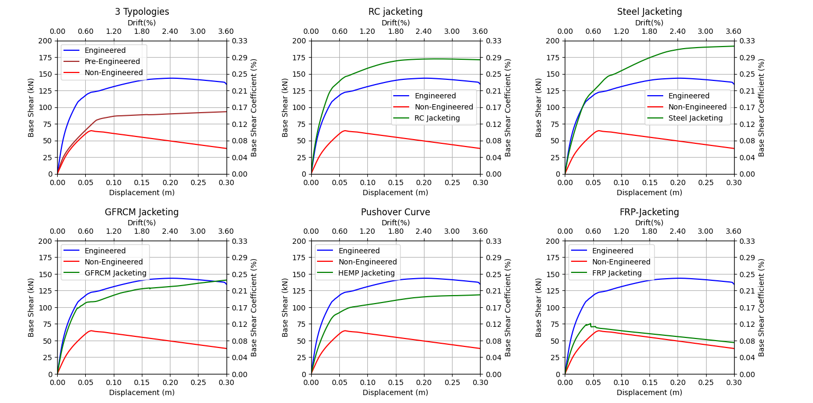
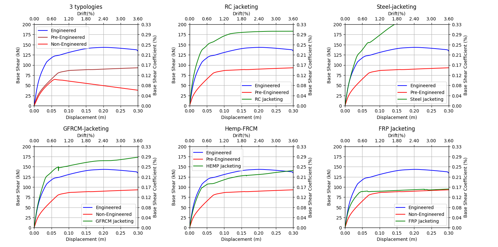
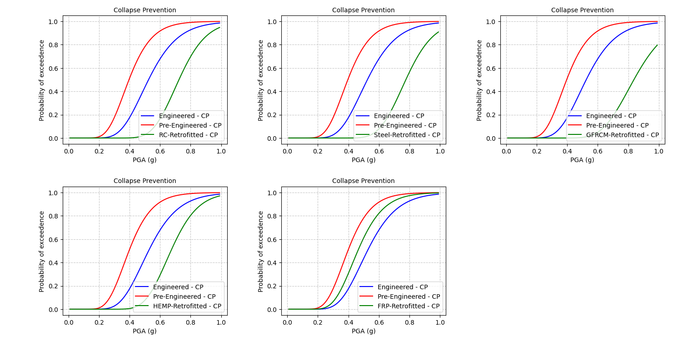

# Seismic resillience of exsisting RC buildings of Nepal

## Overview

In recent decades, Nepal has seen a significant rise in Reinforced Concrete (RC) structures, with approximately 70% classified as non-engineered buildings. These buildings were neither designed nor supervised by engineers and were constructed based on contractors' experience or guidance from mid-level technicians and masons. Nepal, being located in a highly seismically active zone, faces large earthquakes every 60-70 years. The vulnerability of these non-engineered structures is a major concern, as they were designed solely for vertical loads, without considering lateral seismic forces.

## Building Code Development

### Nepal Building Code (NBC)

- **NBC 205:1994 (Mandatory Rules of Thumb - MRT)**: Introduced basic seismic design guidelines.
- **NBC 205:2012**: Enhanced guidelines by improving beam-column sizes and reinforcement.Buildings made from this code are considered as pre-engineered buildings.
- **NBC 105:1994**: Addressed seismic design and ductile detailing aspects.
- **NBC 105:2020**: Improved seismic design provisions of NBC 105:1994, ensuring better seismic safety for all structures.All buildings with implemention of all this code are considered as engineered buildings.

Post-Gorkha earthquake assessments revealed that buildings constructed according to MRT guidelines remained vulnerable to seismic loads. Thus, there is a need for retrofitting existing non-engineered and pre-engineered buildings to enhance their strength and performance capacity.

## Study Objectives

This study aims to assess the strength and capacity of a typical non-engineered RC building and to evaluate the effectiveness of various retrofitting interventions.

### Methodology

1. **Modeling**: A 3-story portal frame consisting of beams and columns was modeled in OpenSees.
2. **Analysis**: Mode analysis, Non-linear dynamic and static analysis was performed to assess the building's strength and capacity.
3. **Retrofitting Interventions**: Five different retrofitting interventions were applied to non-engineered and pre-engineered buildings.
4. **Performance Comparison**: The performance of the retrofitted buildings was compared using pushover curves and fragility curves.

## Retrofitting Interventions

The study evaluates five retrofitting interventions (RC Jacketing, Steel Jacketing, CFRP jacketing, FRCM jacketing) to enhance the seismic performance of non-engineered and pre-engineered buildings. The effectiveness of each intervention is analyzed and compared to ensure the most efficient methods are identified.

## Results and Discussion

The comparative analysis using pushover and fragility curves demonstrates the improved performance of retrofitted buildings. The findings underscore the importance of implementing retrofitting measures to mitigate seismic risks.
### Pushover Curve

    
    
<b>Figure 1:</b> Pushover Curve for Non-engineered with retrofitted

    
    
<b>Figure 1:</b> Pushover Curve for Pre-engineered with retrofitted

### Fragility Curve

    
    
<b>Figure 1:</b> Fragility Curve for Non-engineered with retrofitted in CP limit states

    
    
<b>Figure 1:</b> Fragility Curve for Pre-engineered with retrofitted in CP limit states

The pushover curve shows the load-displacement relationship, indicating the increased capacity of retrofitted buildings. The fragility curve illustrates the probability of reaching or exceeding various damage states, highlighting the enhanced seismic performance after retrofitting. It is observed that retrofitted buildings achived the performance of engineered buildings.

## Conclusion

The study highlights the critical need to retrofit existing non-engineered and pre-engineered buildings in Nepal to ensure their seismic safety. By adopting the updated NBC codes and applying effective retrofitting interventions, the resilience of RC structures against seismic events can be significantly enhanced.

## Repository Structure

- `models/`: Contains OpenSees models of the 3-story portal frame.
- `analysis/`: Scripts for mode analysis, non-linear dynamic and static analysis.
- `results/`: Output files, including pushover and fragility curves.
- `docs/`: Documentation and detailed study reports.
- `src/`: Source code for analysis and visualization.

## Contact
For any inquiries or contributions, please contact [076bce179.suraj@pcampus.edu.np].
